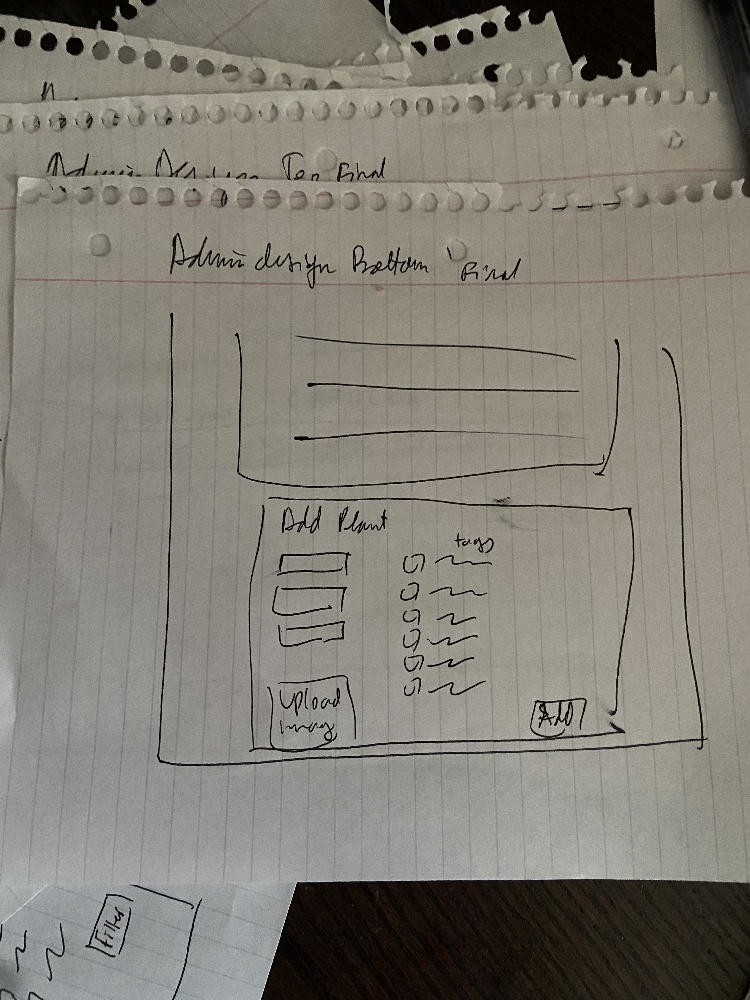
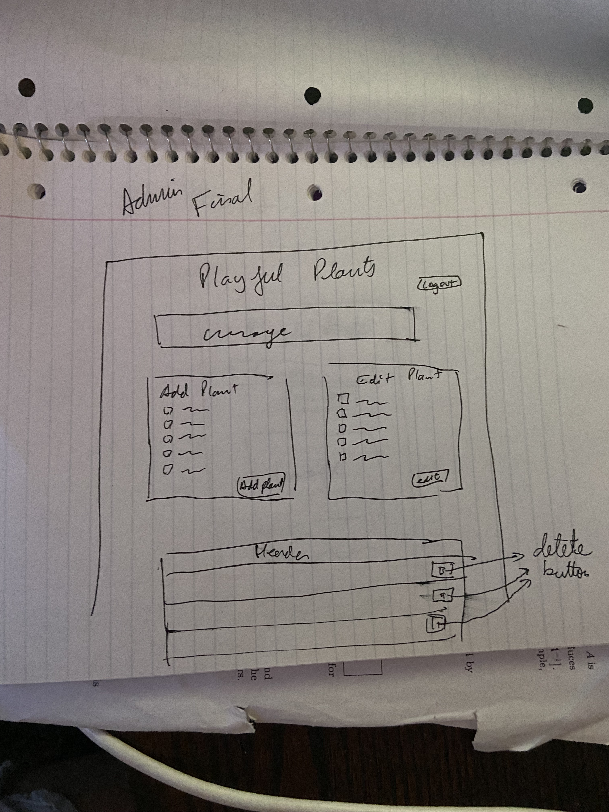

# Project 3: Design Journey

**For each milestone, complete only the sections that are labeled with that milestone.** Refine all sections before the final submission. If you later need to update your plan, **do not delete the original plan, leave it place and append your new plan below the original.** Explain why you are changing your plan. Remember you are graded on your design process. Updating the plan documents your process!

**Replace ALL _TODOs_ with your work.** (There should be no TODOs in the final submission.)

Be clear and concise in your writing. Bullets points are encouraged.

**Everything, including images, must be visible in Markdown Preview.** If it's not visible in Markdown Preview, then we won't grade it. We won't give you partial credit either. **Your design journey should be easy to read for the grader; in Markdown Preview the question _and_ answer should have a blank line between them.**


## Design / Plan (Milestone 1)

**Make the case for your decisions using concepts from class, as well as other design principles, theories, examples, and cases from outside of class (includes the design prerequisite for this course).**

You can use bullet points and lists, or full paragraphs, or a combo, whichever is appropriate. The writing should be solid draft quality.

### Audiences (Milestone 1)
> Who are your site's audiences?
> Briefly explain who the intended audiences are for your project website.
> **DO NOT INVENT RANDOM AUDIENCES HERE!** Use the audiences from the requirements.

_Consumer_: Parents with developing children

"From Playful Plants:

Parents/families are interested in providing high quality nature-rich places on a smaller scale around their homes and communities. They want to pick plants that will provide year-around interest or help to engage children in gardening projects." (taken from Project 3 Write-up)

_Site Administrator_: Members of the Playful Plants project
"From Playful Plants:

* To develop a (searchable) database of playful plants that can support a range of nature play
experiences.
* To provide ideas & plant collections for themed nature play spaces & gardens.
* To develop a web resource for sharing these resources, including the ability to tailor selections and print plant lists." (taken from Project 3 Write-up)


### _Consumer_ Audience Goals (Milestone 1)
> Document your audience's goals.
> List each goal below. There is no specific number of goals required for this, but you need enough to do the job.
> **DO NOT INVENT RANDOM GOALS HERE OR STEREOTYPE HERE!** Your goals are things that your users want accomplish when using the site (e.g. print a list of plants). These are informed by the Playful Plants objectives. Review the assignment's requirements for details.

_Consumer_ Goal 1: They want to know about basic plant care: the hardiness zone, annual vs perennial,the sun requirements, and the general type of plant.

- **Design Ideas and Choices** _How will you meet those goals in your design?_
  - These goals will be met by tagging different plants in the database with these different characteristics so consumers can sort and filter the catalog based on their wants and needs.
- **Rationale & Additional Notes** _Justify your decisions; additional notes._
  - This design decision will help the consumers achieve their goal of learning specifics about the different plants.

_Consumer_ Goal 2: Creating nature-rich spaces (garden using data from website)

- **Design Ideas and Choices** _How will you meet those goals in your design?_
  -  The website will allow consumers to click on the desired plant to see more information about it. By doing viewing this extra information the consumers will be able to decide whether or not they want to use that plant.
- **Rationale & Additional Notes** _Justify your decisions; additional notes._
  - This design choice is good because users can view the entire catalog and sort it, and, once they've narrowed down their search they can click on a plant they are very interested in to see more information about the plant, thereby fulfilling their goal.


### _Consumer_ Persona (Milestone 1)
> Use the goals you identified above to develop a persona of your site's audience.
> Create your persona using GenderMag's customizable personas.
> Take a screenshot and include it here. Persona must be visible in Markdown Preview; do not use PDF format!


### _Administrator_ Audience Goals (Milestone 1)
> Document your audience's goals.
> List each goal below. There is no specific number of goals required for this, but you need enough to do the job.
> **DO NOT INVENT RANDOM GOALS HERE OR STEREOTYPE HERE!** Your goals are things that your users want accomplish when using the site (e.g. print a list of plants). These are informed by the Playful Plants objectives. Review the assignment's requirements for details.

_Administrator_ Goal 1: To develop a (searchable) database of playful plants that can support a range of nature play experiences.

- **Design Ideas and Choices** _How will you meet those goals in your design?_
  - Create a catalog that is searchable, and to which they can add entries via a form.
- **Rationale & Additional Notes** _Justify your decisions; additional notes._
  - By including the catalog I will meet my audience's goal of having a searchable database and being able to add to the database.

_Administrator_ Goal 2: To provide ideas & plant collections for themed nature play spaces & gardens.

- **Design Ideas and Choices** _How will you meet those goals in your design?_
  - Have tags associate with each plant so plants that can be used for similar things/ can be used to create collections can be seen together.
- **Rationale & Additional Notes** _Justify your decisions; additional notes._
  - By adding this funcitonality the adminsitrators will have the ability to include certain tags along with their plants and thus provide ideas and plant collections.


### _Administrator_ Persona (Milestone 1)
> Use the goals you identified above to develop a persona of your site's audience.
> Create your persona using GenderMag's customizable personas.
> Take a screenshot and include it here. Persona must be visible in Markdown Preview; do not use PDF format!


### Site Design (Milestone 1)
> Document your _entire_ design process. **We want to see iteration!**
> **Show us the evolution of your design from your first idea (sketch) to the final design you plan to implement (sketch).**
> **Show us how you decided what data to display to each audience.**
> **Plan your URLs for the site.**
> **Provide a brief explanation _underneath_ each design artifact (2-3 sentences).** Explain what the artifact is, how it meets the goals of your personas (**refer to your personas by name**).
>
> **Important!** Plan _all_ site requirements. Don't forget login and logout.

_Initial Designs / Design Iterations:_
Consumer designs main page(initial):


Consumer designs item page(initial):


Admin page design(initial):

1st


2nd



Login design (initial):


_Final Design:_
Consumer design main page(final):


There is a hamburger menu containing the filter and sort forms so the UI isn't too clunky and full of stuff. The media is displayed by 3 plants per row so Abi can see many at a time. Beneath each image of each plant there will be the plant's name and its associated tags, so Abi can know what type of plant it is, and what it can be used for.

Consumer design item page(final):


Simple plant display page. Can see all relevant information on one screen.

Login design (final):


Very simple login webpage, easy for anyone to use.

Admin design (final)

The admin site was designed with usability in mind. There is a Delete button at the top of the catalog which, when pressed, will open up a hamburger menu contianing the form to delete an entry. There is also an 'Add Plant' form beneath the catalog so Time can add entries to the database.


### Design Pattern Explanation/Reflection (Milestone 1)
> Write a one paragraph (6-8 sentences) reflection explaining how you used design patterns for media catalogs in your site's final design.

As the name implies, media catalogs are catalogs made up of media such as images and videos. My site does just that, while keeping the media properly aligned so users can view the media more easily. Another design pattern for media catalog is displaying some sort of identifying information beyond the image, such as a name or associated tag. My website has employed these design patterns to make it easier for the user to know what they are looking at specifically. Another design pattern that I have employed in my site is having the media be large enough that they are easily visible to the user. This makes it so users do not have to pinch to zoom and see an image.

### Cognitive Styles Explanation/Reflection (Milestone 1)
> Write a one paragraph (6-8 sentences) reflection explaining how your final design supports the cognitive styles of each persona.

_Consumer Cognitive Styles Reflection:_

My consumer is Abi. She is highly risk averse about using unfamiliar technologies that might make her waste her spare time. To this end I have designed my media catalog in a similar fashion to many popular applications such as Instagram, Pinterest, and others. She can scroll through the images and press on them to view more details. Due to Abi's comprehensive information processing style, she tends to attempt to understand the entierty of a technology before diving in to use it. To satisfy this need, the site was designed to be simple to understand comprehensively, and Abi can get straight to using it.

_Site Administrator Cognitive Styles Reflection:_

Tim is the type of person who likes learning all the available functionality on all his devices, even if it is not necessary to accomplish his goals. For this reason I have decided to include a delete button in my administrator catalog. Furthermore, Tim is confident with his abilities with technology so I have designed forms that allow for maximal customization, and I believe that this will cater to Tim’s abilities. Tim’s information processing style is ‘depth first’. This means that he likes to explore one possibility at a time, exploring it thoroughly before moving on. Since Tim is very confident with his abilities in technology then he wouldn’t have a problem fulfilling his subgoal of logging in as an administrator in order to edit, delete or add plants. Since another one of his subtasks would be to upload a plant and he likes tinkering and exploring the menu items, then he should have no problem finding the upload form on the admin page. Once he locates the upload form, he should have no problem uploading an image and filling out the rest of the form since he is confident in his abilities with technology.


## Implementation Plan (Milestone 1, Milestone 2, Milestone 3, Final Submission)

### Database Schema (Milestone 1)
> Describe the structure of your database. You may use words or a picture. A bulleted list is probably the simplest way to do this. Make sure you include constraints for each field.
> **Hint: You probably need a table for "entries", `tags`, `"entry"_tags`** (stores relationship between entries and tags), and a `users` tables.
> **Hint: For foreign keys, use the singular name of the table + _id.** For example: `image_id` and `tag_id` for the `image_tags` (tags for each image) table.

Table: users
- id: INTEGER {NN, PK, U, AI },
- username: TEXT {NN, U},
- password: TEXT {NN}

Table: tags
- id: INTEGER {NN, PK, U, AI },
- tag_name: TEXT {NN, U},

Table: plants
- id: INTEGER {NN, PK, U, AI },
- plant_id: TEXT {NN, U},
- name_coll: TEXT {U, NN}
- name_sci: TEXT {U, NN}
- is_explora_const: TEXT { }
- is_physical: TEXT { }
- is_imaginative: TEXT { }
- is_sensory
- is_restorative: TEXT { }
- is_expressive: TEXT { }
- is_rules: TEXT{ }
- is_bio: TEXT{ }
- Perennial: INTEGER {}
- Annual: INTEGER {}
- Full Sun: INTEGER {}
- Partial Shade: INTEGER {}
- Full Shade: INTEGER {}
- Hardiness Zone Range: INTEGER {}
- image_id

Table: plant_tag
- id: INTEGER {NN, PK, U, AI },
- plant_id: TEXT {NN} Foriegn Key
- tag_id: TEXT {NN} Foreign Key


Table: images
- id: INTEGER {NN, PK, U, AI }
- src: TEXT {}

Table: sessions
- id: INTEGER {NN, PK, U, AI }
- user_id: TEXT {NN}
- session: TEXT {U, NN}
- last_login: TEXT {NN}


### Database Query Plan (Milestone 1, Milestone 2, Milestone 3, Final Submission)
> Plan _all_ of your database queries. You may use natural language, pseudocode, or SQL

## Consumer page:

```
SELECT plants.name_coll AS 'name_coll', tags.tag_name AS 'tag_name'
  FROM plant_tags
  INNER JOIN plants ON (plants.id = plant_tags.plant_id)
  INNER JOIN tags ON (tags.id = plant_tags.tag_id);
```

```
SELECT name_coll FROM plants WHERE ([filter conditions]);
```

```
SELECT * FROM plants ORDER BY ([sort condition]);
```

```
SELECT * FROM users WHERE (username== :username_submitted AND password == :password_submitted);
```

# Admin page:

Select all database entries relevant to the administrators
```
SELECT name_coll, name_sci, plant_id, is_explora_const, is_sensory, is_physical, is_imaginative, is_restorative, is_expressive,is_rules, is_bio FROM plants;
```

Insert entry into database
```
INSERT (name_coll, name_sci, is_explora_const ...) INTO plants VALUES (:name_coll, :name_sci, :is_explora_const ...);
```

Delete entry from database
```
DELETE FROM plants WHERE (plant_id == :plant_id);
```

```
UPDATE plants SET (name_coll = :name_coll, name_sci = :name_sci ...) WHERE plant_id = :plant_id;
```

# Product Page

```
SELECT name_sci, name_coll FROM plants;
```

### Code Planning (Milestone 1, Milestone 2, Milestone 3, Final Submission)
> Plan any PHP code you'll need here using pseudocode.
> Tip: Break this up by pages. It makes it easier to plan.


FILTER FORM pseudocode  (executes after 'Filter' form is submitted):
1. open connection to the database
if user submitted the form:
create form_valid variable and set to false
2. gather inputs from user in form (i.e. using superglobal $_GET)
3. create variables for each part of SQL query (for select, where and order))
4. check through filter variables, if they the variable is set, then add the variable to the 'where' part of the SQL query and set form_valid to true
5. if any variable is selected for sorting, append it to the 'ORDER' clause of the SQL query
6. once all variables have been checked, query the db with the constructed query
7. if form_valid is false display feedback
   else display table from query


INSERTION FORM pseudocode (executes after 'Add Plant' form is submitted):

if user submitted form:
1. gather user input from $_GET superglobal
2. create variable form_valid and set to false
3. create variables to construct SQL query (insert, values)
4. plant colloquial and scientific names are required, and at least 3 features of the plant are required (without description)
5. to check this, create a count variable, and increase it every time a user selected a feature
 5a. While this is being done, append the selected variables to the SQL query
6. if count < 3, display feedback for features
7. else set form_valid to true
8. if neither the colloquial nor scientific names were provided, provide feedback for names and set form_valid to false
9. if form_valid is true, construct the SQL query and insert the values into the table

LOGIN FORM (executes when 'Log in' form is submitted):
1. if user submitted form
2. query users db for record matching the submitted username and password
3. if there is a matching record --> redirect to admin website
4. else display feedback (i.e. incorrect username or password)

DELETION FORM (executes when 'Delete a plant' form is submitted):
1. if form was submitted
2. check if the plant id entered matches any of the ones in the database
3. if so, delete that record
4. else display feedback (i.e. plant not found)

UPDATE FORM (Executes when ('Edit a plant' form is submitted)):
1. if form was submitted
2. confirm that at least one attribute was entered
3. if so, construct UPDATE SQL query using the data input by the user, and execute it
4. else, display feedback (i.e. please submit at least one edit)

VIEW ITEM DETAILS (Executes when an item is clicked on in the media catalog)
1. if item was pressed
2. redirect to /details
  a. add query string parameters
3. using query string parameters collect required data from database
4. display data on details page

UPLOAD AN IMAGE
1. check if image was submitted
2. if so make sure that it the error message in the file superglobal is 0
3. dissect the name and the extension of the image file
4. gather last entered id in plants table
5. concatenate the id with the file extension and upload to 'uploads file'


### Accessibility Audit (Final Submission)
> Tell us what issues you discovered during your accessibility audit.
> What do you do to improve the accessibility of your site?

Inputs and labels are not linked together. There was some alt text missing. There's also some bad contarast between feedback messages and the site's backgrouind color.


## Reflection (Final Submission)

### Audience (Final Submission)
> Tell us how your final site meets the goals of your audiences. Be specific here. Tell us how you tailored your design, content, etc. to make your website usable for your personas.

My site has two distinct audiences. One of these audiences are parents with developing children, such as Abi. Abi represents the consumers of the website. They desire to view all entries in the catalog with the goal of learning what plants are out there, and how they can be grown. Their ultimate goal is to create high quality nature=rich place around their homes and communities for their children to play with. To achieve these goals, I have created a home page that displays all plants in the catalog, along with an image and their associated tags. Abi can then use the filter form to narrow down her search. Furthermore, if she presses on an image she will be directed to that plant’s details page, where she can view all information about growing the plant.

The second audience are members of the playful plants project. They want to develop a searchable database of playful plants so that they can support a range of nature play experiences. To that end, I have created a catalog that displays all the information about the plants in the database. Only users that have signed in may add, edit or delete something from the catalog, thus maintaining the integrity of the data stored inside it.


### Additional Design Justifications (Final Submission)
> If you feel like you haven’t fully explained your design choices in the final submission, or you want to explain some functions in your site (e.g., if you feel like you make a special design choice which might not meet the final requirement), you can use the additional design justifications to justify your design choices. Remember, this is place for you to justify your design choices which you haven’t covered in the design journey. You don’t need to fill out this section if you think all design choices have been well explained in the design journey.

None.

### Self-Reflection (Final Submission)
> Reflect on what you learned during this assignment. How have you improved from Project 2? What would you do differently next time?

This project was very challenging but I felt that I learned a lot, especially with regards to SQL and taking user input to create queries. I found it very cool to start learning the basics of cybersecurity, and that has opened my curiosity to learning more about how to keep websites and their data safe. What I would do differently next time is probably start a bit earlier/do less time consuming extracurricular activities.


> Take some time here to reflect on how much you've learned since you started this class. It's often easy to ignore our own progress. Take a moment and think about your accomplishments in this class. Hopefully you'll recognize that you've accomplished a lot and that you should be very proud of those accomplishments!

I have certainly learned a lot about back end web programming and design, and I have accomplished a lot in this class.


### Grading: Step-by-Step Instructions (Final Submission)
> Write step-by-step instructions for the graders.
> The project if very hard to grade if we don't understand how your site works.
> For example, you must login before you can delete.
> For each set of instructions, assume the grader is starting from /


_View all entries:_

1. Open the home page

_View all entries for a tag:_

1. Open filter drop down form
2. select desired tag
3. submit form.

_View a single entry's details:_

1. Click on any entry’s photo

_How to insert and upload a new entry:_

1. Select ‘admin’ from the nav bar
2. This will prompt a ‘sign in’
3. Sign in username ‘kyle’ and password ‘monkey’
4. Fill out form at the bottom of the page to insert a new entry and upload an image.

_How to delete an entry:_

1. Select ‘admin’ from the nav bar
2. This will prompt a ‘sign in’
3. Sign in username ‘kyle’ and password ‘monkey’
4. Find the desired entry and select the delete icon in its row
5. You will be taken to a page to confirm that you want to delete that plant

_How to edit and existing entry and its tags:_

1. Select ‘admin’ from the nav bar
2. This will prompt a ‘sign in’
3. Sign in username ‘kyle’ and password ‘monkey’
4. Find the desired entry and select the edit icon in its row
5. You will be taken to a page to edit the plant
6. Make all necessary changes and submit form
